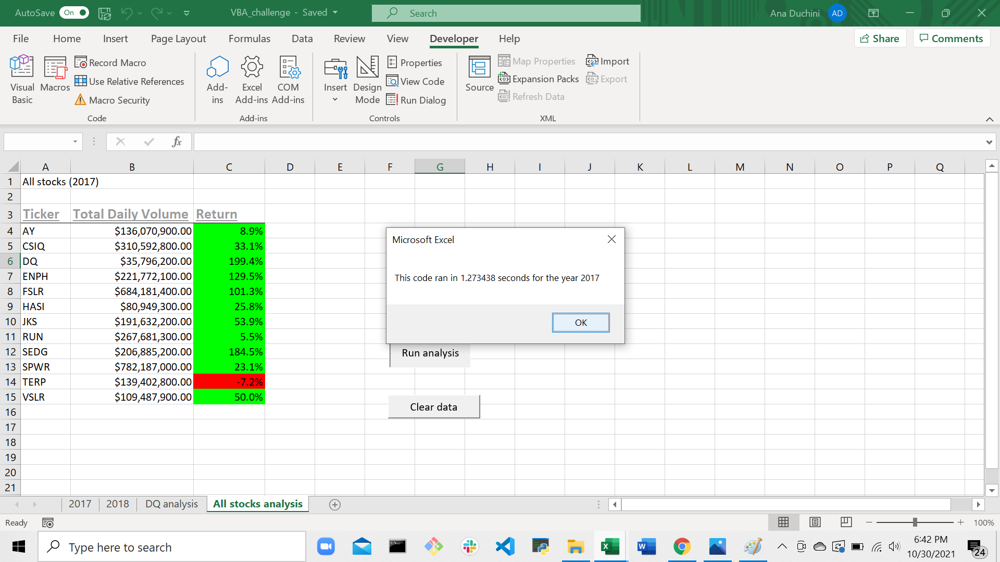
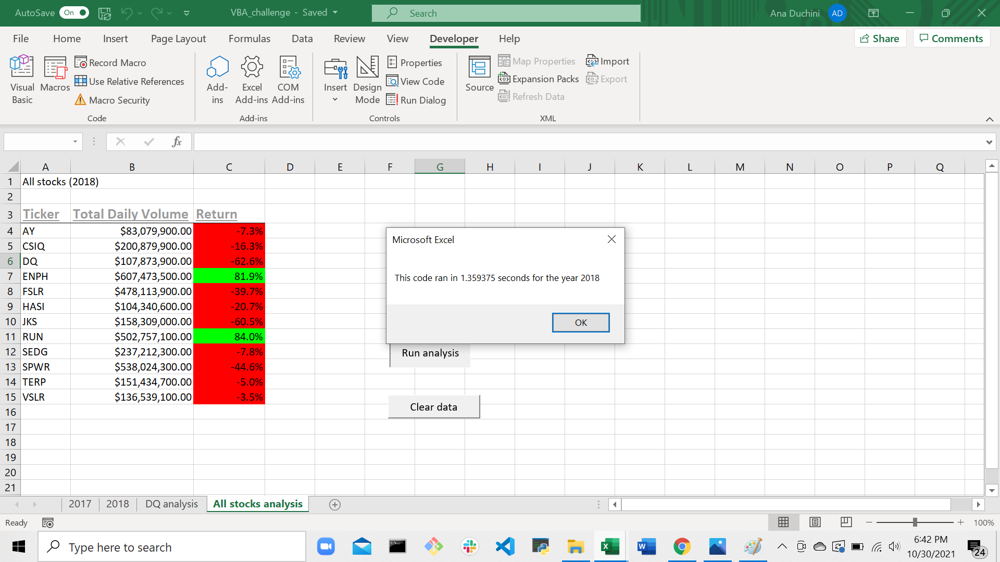
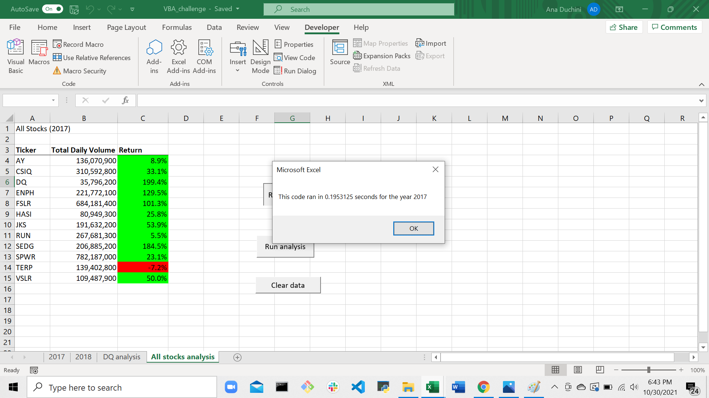

# Stock Market Analysis

## Overview of Project: Explain the purpose of this analysis.
Steve's parents are looking to invest in green energy stocks. They have invested all their money in DAQO New Energy Corp (ticker symbol: *DQ*), a company that makes silicon wafers for solar panels. Steve is concerned with diversifying their funds. He has acquired the data of 12 green energy stocks for the years 2017 and 2018. He needs assistance analyzing this data.

## Results: Using images and examples of your code, compare the stock performance between 2017 and 2018, as well as the execution times of the original script and the refactored script.

Visual Basic for Applications (VBA) was used to process the data from the [spreadsheet (zipped file)](VBA_challenge.zip) containing the green energy stocks data, that was created by Steve.

### Calculations
The VBA function calculates, for each stock, the total annual volume and the return on investment, for the year selected (only 2017 and 2018 were available). It works via a button, that launches a prompt window requesting the choice of year for the calculations. The code was created once, and then refactored in a second function, to optimize.

#### First Module
A first attempt at performing the calculations was done using a function named **AllStocksAnalysis**.

The function first populates the headers on the results sheet, named **All stocks analysis**. It iterates through the stocks, switching back and forth between reading from the data worksheet and writing to the output worksheet, and uses temporary variables to store values for each stock. It also calculates the difference between beginning/ending timestamps as an indicator of the speed of the process.

*Screenshot of results for first attempt on the year 2017*

*Screenshot of results for first attempt on the year 2018*

#### Refactored Module
A new, refactored, function was created from the first attempt above, named *AllStocksAnalysisRefactored*. And a new button created to run it.

The function uses arrays to store volumes, starting and ending prices for each ticker. It runs through a loop to read the data, and a different loop to write the results. 

*Screenshot of results for refactored analysis for 2017*

*Screenshot of results for refactored analysis for 2018*

## Summary

#### What are the advantages or disadvantages of refactoring code? How do these pros and cons apply to refactoring the original VBA script?
By using arrays, instead of temporary variables, the refactored function is able to read through all the data, without having to switch multiple times between worksheets. It runs about 10 times faster than the initial version of the function. However, by employing arrays, it needs to allocate more memory to store the information for all the tickers at once.

